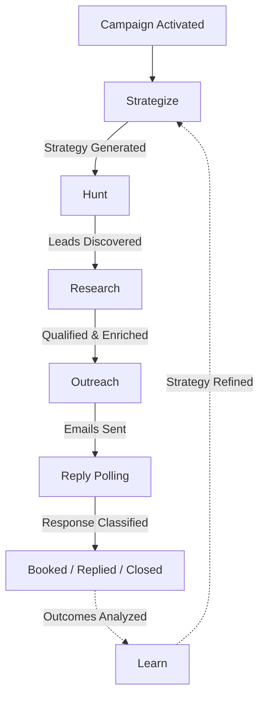

<div align="center">
  <h1>
    
    PHANTOM OSS
  </h1>
  <em>Autonomous client acquisition protocol. Always on the case.</em>
  <br/><br/>
  <p>A state-aware, multi-agent protocol designed to handle the entire client acquisition funnel from cold discovery and deep research to personalized outreach and autonomous booking.</p>
</div>

---

## Philosophy: Agents, Not Workflows

Most sales automation tools are glorified mail-merge with a scheduler bolted on. They follow rigid, linear sequences that break the moment a prospect says something unexpected.

Phantom is different. It deploys **autonomous reasoning swarms** - AI agents that adapt dynamically to lead responses, website context, and business constraints. Each agent in the swarm has a specialized role, its own reasoning loop, and the ability to act on incomplete information. The protocol bridges the gap between raw data and booked meetings without requiring a human to babysit every step.

The result: a self-sustaining acquisition loop that runs while you sleep.

---

## The Phantom Protocol

Phantom orchestrates six highly specialized, state-aware AI agents through a distributed job queue. Each agent picks up where the last one left off, enriching lead state as it moves through the pipeline.

### 1. Strategist Agent

**Role:** Campaign Orchestrator and Planner.

The Strategist analyzes your agency profile - services, target industries, unique value propositions, case studies - and your campaign instructions to generate a hyper-customized acquisition strategy. It doesn't just pick keywords. It defines who you're going after, why they'd care, what to say when they push back, and how to close.

**Output:** Sharpened Ideal Company Profile (ICP), recommended search angles, qualification and disqualification criteria, tone and messaging strategy, objection handling scripts, and key booking triggers.

### 2. Hunter Agent

**Role:** Autonomous Lead Discovery Node.

The Hunter takes the Strategist's search angles and acts as a pure discovery engine. It uses the Serper (Google Search) API to generate targeted queries and find high-intent domain URLs. It then runs them through a strict, dynamic anti-portal/directory filter to ensure only actual business websites enter the pipeline.

**Output:** A high-volume list of targeted, raw lead candidates ready for qualification.

### 3. Researcher Agent

**Role:** Deep Technical Enrichment and Qualification.

The Researcher crawls each discovered lead's website using Jina Reader to fetch full markdown pages. It acts as the primary qualification filter: scoring the lead against the strategy, mapping specific technical gaps and pain points, and combining AI website extraction with the Hunter.io API to extract and verify decision-maker contact details.

**Output:** Enriched lead profiles containing decision-maker contacts, verified pain-point hypotheses, and custom research context.

### 4. Outreacher Agent

**Role:** Human-Centric Personalized Copywriter.

The Outreacher generates highly personalized email sequences, initial message and multi-step follow-ups using the lead's unique research profile and matching agency case studies. Every email references something specific about the prospect. No generic templates. Emails are sent directly via your connected SMTP inbox.

**Output:** Drafted and scheduled outreach sequences sent via Nodemailer.

### 5. Reply Handler Agent

**Role:** Sentiment-Aware Negotiation and Booking.

The Reply Handler polls your inbox via IMAP, classifies every inbound response (interested, asking questions, not interested, out of office), handles objections dynamically, and pushes interested leads to book a call through Calendly. It doesn't just detect intent, it negotiates.

**Output:** Auto-drafted replies and direct booking updates in the database.

### 6. Learner Agent

**Role:** Continuous Feedback and Strategy Optimization.

The Learner analyzes the outcomes of your outreach - which messages booked calls, which angles failed, and what specific objections leads raised in their replies. It persists these insights into the memory vault and triggers the Strategist to dynamically refine and update the live campaign strategy based on real-world data.

**Output:** Actionable campaign learnings and strategy update triggers.

### Lead Lifecycle



---

## Architecture

### Tiered AI Router

Phantom uses a provider-agnostic AI routing layer built on the OpenAI-compatible API standard. Every LLM call in the system goes through a three-tier router - flash models for the fastest tasks, fast models for grunt work, and smart models for the tasks that actually matter.

| Tier | Used For | Default Model | Override |
| :--- | :--- | :--- | :--- |
| **Flash** | Ultra-fast classification, simple extraction | `qwen3.5-flash` | `AI_FLASH_MODEL` |
| **Fast** | Classification, data extraction, JSON parsing, formatting | `qwen3.7-plus` | `AI_FAST_MODEL` |
| **Smart** | Strategy formulation, personalized copywriting, objection handling, multi-turn reasoning | `qwen3.7-max` | `AI_SMART_MODEL` |

The defaults use Alibaba's open-weight Qwen 3.7 models via DashScope, but you can point Phantom at any OpenAI-compatible endpoint - vLLM, Ollama, Groq, OpenAI, or anything else that speaks the same API. You can also set `AI_API_KEY` or `QWEN_API_KEY` as convenience shortcuts for specific providers.

### BullMQ Job Engine

The agent pipeline runs on BullMQ backed by Redis. No polling loops. No cron hacks.

- **Static global queues** : per agent type (`hunt-Queue`, `outreach-Queue`, etc.)
- **Zero-polling scheduler** : uses Redis delayed jobs to fire campaigns at exact times without querying MongoDB on an interval
- **Self-terminating workers** : workers shut down automatically when their queue drains, conserving resources until more work arrives
- **Exponential backoff** : failed jobs retry up to 3 times with increasing delay
- **Dedicated scheduler worker** : a separate `scheduler.worker.ts` manages campaign timing and lifecycle outside the agent pipeline

---

## Tech Stack

| Layer | Technology |
| :--- | :--- |
| Runtime | Node.js v20+ |
| Backend | Express 5 · TypeScript |
| Frontend | Next.js 16 · React 19 · Tailwind CSS v4 |
| Agent Framework | LangGraph · LangChain (OpenAI-compatible) |
| Database | MongoDB · Mongoose |
| Job Queue | BullMQ · Redis (ioredis) |
| Authentication | JWT · bcryptjs · Cookie-based sessions |
| Email (outbound) | Nodemailer (SMTP) |
| Email (inbound) | imapflow · mailparser |
| State Management | Zustand |
| Validation | Zod |
| UI | Framer Motion · Lucide React · Lenis |
| HTTP Client | Axios |

---

## Getting Started

### Before You Begin — Gather Your Keys

Phantom requires a few external accounts. Get these set up first and keep the keys handy.

| Service | What It's Used For | Free Tier? | Sign Up |
| :--- | :--- | :---: | :--- |
| **AI Provider** (e.g. Qwen Cloud) | Runs all six agents | ✅ | [Qwen Cloud](https://www.qwencloud.com/) · [OpenAI](https://platform.openai.com) · [Groq](https://console.groq.com) |
| **Serper** | Google Search API for lead discovery | ✅ 2 500 free queries | [serper.dev](https://serper.dev) |
| **Hunter.io** | Email discovery and verification | ✅ 50 free/month | [hunter.io](https://hunter.io) |
| **Email account** | SMTP sending + IMAP reply polling | ✅ Gmail works | [Gmail App Password guide](#gmail-app-password) |


### System Prerequisites

- [Node.js](https://nodejs.org/) v20 or later — `node --version` to check
- [pnpm](https://pnpm.io/) — `npm i -g pnpm`
- [Docker Desktop](https://www.docker.com/products/docker-desktop/) (for the recommended Docker path)

### Step 1 — Clone and Install

```bash
git clone https://github.com/m-taqii/phantomoss.git
cd phantomoss
```

### Step 2 — Configure the Server

Copy the example env file and fill it in:

```bash
cp server/.env.example server/.env
```

Then open `server/.env` and set the following:

**Infrastructure** (pre-filled if using Docker — no changes needed):
```env
PORT=8080
MONGODB_URI=mongodb://localhost:27017/phantomdb
REDIS_URL=redis://localhost:6379
CLIENT_URL=http://localhost:3000
```

**Auth** (generate any long random string):
```env
JWT_SECRET=change-me-to-any-long-random-string
JWT_EXPIRES_IN=7d
```

**AI Provider** — pick one that suits you:
```env
# Option A: DashScope (Alibaba Qwen — recommended default)
AI_API_KEY=your-dashscope-api-key
AI_BASE_URL=https://dashscope-intl.aliyuncs.com/compatible-mode/v1
AI_FAST_MODEL=qwen-plus
AI_SMART_MODEL=qwen-max

# Option B: Groq (free, fast)
AI_API_KEY=your-groq-api-key
AI_BASE_URL=https://api.groq.com/openai/v1
AI_FAST_MODEL=llama-3.1-8b-instant
AI_SMART_MODEL=llama-3.3-70b-versatile

# Option C: OpenAI
AI_API_KEY=your-openai-api-key
# AI_BASE_URL is not needed for OpenAI — it's the default
AI_FAST_MODEL=gpt-4o-mini
AI_SMART_MODEL=gpt-4o
```

**Lead Discovery APIs:**
```env
SERPER_API_KEY=your-serper-api-key      # serper.dev
HUNTER_API_KEY=your-hunter-api-key     # hunter.io
```

**Email (SMTP + IMAP):**
```env
SMTP_HOST=smtp.gmail.com
SMTP_PORT=587
SMTP_USER=you@yourdomain.com
SMTP_PASS=your-app-password        # See Gmail App Password section below
SMTP_SECURE=false
SMTP_FROM_NAME=Your Name
SMTP_FROM_ADDRESS=you@yourdomain.com

IMAP_HOST=imap.gmail.com
IMAP_PORT=993
IMAP_USER=you@yourdomain.com       # Falls back to SMTP_USER if omitted
IMAP_PASS=your-app-password        # Falls back to SMTP_PASS if omitted
```

### Step 3 — Configure the Client

Create `client/.env`:

```bash
echo "NEXT_PUBLIC_BASE_URL=http://localhost:8080" > client/.env
```

### Step 4 — Launch

**Docker (recommended — spins up everything automatically):**

```bash
docker-compose up -d
```

This starts four containers: MongoDB, Redis, the Express API (`localhost:8080`), and the Next.js dashboard (`localhost:3000`).

**Manual (without Docker):**

```bash
# Terminal 1 — start MongoDB and Redis yourself (via Docker or a local install)
docker run -d -p 27017:27017 mongo:7
docker run -d -p 6379:6379 redis:7-alpine

# Terminal 2 — backend
cd server && pnpm install && pnpm run dev

# Terminal 3 — frontend
cd client && pnpm install && pnpm run dev
```

### Step 5 — First Use

1. Open `http://localhost:3000` in your browser
2. Click **Register** to create your account
3. Go to **Settings** and fill in your agency profile (name, services, case studies, target market)
4. Go to **Campaigns** → **New Campaign** and describe who you want to target
5. Activate the campaign — Phantom will start hunting leads immediately

---

## Gmail App Password

If you use Gmail for SMTP/IMAP, you must generate an **App Password** (your regular Gmail password won't work with SMTP):

1. Go to [myaccount.google.com/security](https://myaccount.google.com/security)
2. Enable **2-Step Verification** if not already on
3. Search for **"App passwords"** on the same page
4. Create a new app password — select **Mail** and your device
5. Copy the 16-character password and paste it as `SMTP_PASS` (and `IMAP_PASS`)

> **Using a custom domain?** If your email is on Google Workspace (`you@yourcompany.com`) the process is identical — just use that address for `SMTP_USER`.

---

## Troubleshooting

**Agents aren't running / campaign is stuck**
- Check that Redis is reachable: `redis-cli ping` should return `PONG`
- Check server logs: `docker logs phantom_server` or your terminal output
- Verify `AI_API_KEY` and `AI_BASE_URL` are correct — a bad key produces no error until an agent fires

**No leads being discovered**
- Confirm `SERPER_API_KEY` is valid — test it at [serper.dev/playground](https://serper.dev/playground)
- Make sure your campaign has a clear target market description in the strategy

**Emails aren't sending**
- Gmail: ensure you're using an **App Password**, not your login password
- Check `SMTP_HOST`, `SMTP_PORT`, and `SMTP_SECURE` match your provider's settings
- Port `587` + `SMTP_SECURE=false` (STARTTLS) is the most common working combination

**Reply Handler not picking up emails**
- IMAP must be enabled in your Gmail settings: **Settings → See all settings → Forwarding and POP/IMAP → Enable IMAP**
- Make sure `IMAP_HOST` / `IMAP_PORT` are correct (`imap.gmail.com` / `993`)

**Docker containers fail to start**
- Ensure ports 3000, 8080, 27017, and 6379 are not in use by another process
- Run `docker-compose down -v` then `docker-compose up -d` for a clean start

---

## Configuration Reference

### Server (`server/.env`)

| Variable | Required | Description |
| :--- | :---: | :--- |
| `PORT` | Yes | Backend server port (default: `8080`) |
| `MONGODB_URI` | Yes | MongoDB connection string |
| `REDIS_URL` | Yes | Redis connection string |
| `REDIS_HOST` | No | Redis host override (alternative to `REDIS_URL`) |
| `REDIS_PORT` | No | Redis port override |
| `REDIS_PASSWORD` | No | Redis authentication password |
| `JWT_SECRET` | Yes | Secret key for JWT token signing |
| `JWT_EXPIRES_IN` | No | JWT token lifetime (default: `7d`) |
| `CLIENT_URL` | Yes | URL of the frontend client (default: `http://localhost:3000`) |
| `AI_API_KEY` | Yes | API key for the AI provider |
| `AI_BASE_URL` | No | Custom OpenAI-compatible endpoint (default: Alibaba DashScope) |
| `AI_FAST_MODEL` | No | Model for the fast tier (default: `qwen3.7-plus`) |
| `AI_SMART_MODEL` | No | Model for the smart tier (default: `qwen3.7-max`) |
| `AI_FLASH_MODEL` | No | Model for the flash tier (optional) |
| `QWEN_API_KEY` | No | Convenience shortcut for Qwen/DashScope provider |
| `SERPER_API_KEY` | Yes | API key for Serper.dev Google Search integration |
| `HUNTER_API_KEY` | Yes | API key for Hunter.io email discovery and verification |
| `SMTP_HOST` | Yes | SMTP server hostname for outbound emails |
| `SMTP_PORT` | No | SMTP server port (default: `587`) |
| `SMTP_USER` | Yes | SMTP authentication username |
| `SMTP_PASS` | Yes | SMTP authentication password / app password |
| `SMTP_SECURE` | No | Use TLS (`"true"` for port 465, `"false"` for STARTTLS) |
| `SMTP_FROM_NAME` | No | Display name for outbound emails |
| `SMTP_FROM_ADDRESS` | No | From address for outbound emails (defaults to `SMTP_USER`) |
| `EMAIL_FROM` | No | Alternative single from address (e.g. `Name <email@domain.com>`) |
| `IMAP_HOST` | Yes | IMAP server hostname for inbound reply polling |
| `IMAP_PORT` | No | IMAP server port (default: `993`) |
| `IMAP_USER` | No | IMAP username (defaults to `SMTP_USER`) |
| `IMAP_PASS` | No | IMAP password (defaults to `SMTP_PASS`) |

### Client (`client/.env`)

| Variable | Required | Description |
| :--- | :---: | :--- |
| `NEXT_PUBLIC_BASE_URL` | Yes | Public URL of the backend API (default: `http://localhost:8080`) |
| `INTERNAL_API_URL` | No | Internal Docker network URL for server-side API calls (auto-set by Docker Compose) |

---

## Project Structure

```
phantomoss/
├── client/                  # Next.js 16 frontend dashboard
│   ├── app/                 # App router pages and layouts
│   │   ├── dashboard/       # Main dashboard (campaigns, leads, outreach, memory, settings)
│   │   ├── login/           # Authentication pages
│   │   └── register/
│   ├── components/          # React components
│   │   ├── dashboard/       # Campaign cards, modals, strategy viewer
│   │   └── ui/              # Shared UI primitives
│   ├── hooks/               # Custom React hooks
│   ├── lib/                 # Client-side utilities
│   ├── store/               # Zustand global state stores
│   └── proxy.ts             # Next.js middleware for auth-protected routes
├── server/                  # Express backend and agent engine
│   ├── index.ts             # Server entry point
│   └── src/
│       ├── app.ts           # Express app setup and middleware registration
│       ├── controllers/     # Route handlers
│       ├── middlewares/     # Custom middleware (auth, error handling)
│       ├── engine/
│       │   ├── agents/      # Agent implementations (strategist, Hunter, researcher, outreacher, inbox_handler, learner)
│       │   ├── workers/     # BullMQ worker definitions (per-agent + scheduler)
│       │   └── queue.ts     # Queue factory and configuration
│       ├── lib/             # Core utilities (AI router, Redis, DB, email, JWT, logger)
│       ├── models/          # Mongoose schemas (agency, campaign, lead, outreach, learning)
│       ├── routes/          # Express route definitions
│       ├── schemas/         # Zod validation schemas
│       └── services/        # Business logic layer
└── docker-compose.yaml      # Full stack: MongoDB, Redis, server, and client
```

---

## Contributing

Contributions are welcome - whether it's a bug fix, a new AI provider integration, or an improvement to the agent pipeline. Open a pull request and provide clear context for the change.

Please ensure `pnpm run build` passes in `server/` before submitting.

---

## License

This project is licensed under the [GNU Affero General Public License v3.0](LICENSE).
