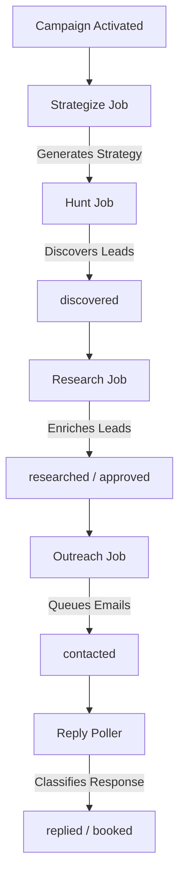

<div align="center">
  <h1>
    
    PHANTOM
  </h1>
  <em>Autonomous client acquisition protocol. Always on the case.</em>
  <br/><br/>
  <p>A state-aware, multi-agent protocol designed to handle the entire client acquisition funnel from cold discovery and deep research to personalized outreach and autonomous booking.</p>
</div>

---

## 🧠 Philosophy: Agents, Not Workflows

Phantom is built on the belief that client acquisition should be a self-sustaining, autonomous loop.

Instead of rigid, brittle step-by-step linear automation, Phantom uses **autonomous reasoning swarms** that adapt dynamically to lead responses, website context, and business constraints. The protocol bridges the gap between raw data and booked meetings without manual intervention at every step.

---

## 🌪️ The Phantom Protocol

Phantom orchestrates five highly specialized, state-aware AI agents through a distributed MongoDB job queue.

### 🧠 1. Strategist Agent (`server/src/engine/agents/strategist`)
- **Role:** Campaign Orchestrator & Planner.
- **Function:** Analyzes the agency profile (services, target industries, unique value propositions, case studies) and campaign instructions to generate a hyper-customized campaign strategy.
- **Output:** Sharpened Ideal Company Profile (ICP), recommended search angles, qualification/disqualification criteria, tone/messaging strategy, objection handling scripts, and key booking triggers.

### 🕵️ 2. Hunter Agent (`server/src/engine/agents/Hunter`)
- **Role:** Autonomous Lead Discovery Node.
- **Function:** Generates targeted search queries based on the Strategist's search angles and target keywords, then queries DuckDuckGo, Google Maps, and other search engines to discover potential leads.
- **Output:** Scraped lead candidates enriched with contact details, qualified and scored (0-100) using LLM reasoning against the Strategist's qualification and disqualification criteria.

### 🔍 3. Researcher Agent (`server/src/engine/agents/researcher`)
- **Role:** Deep Technical & Capability Enrichment.
- **Function:** Crawls qualified leads' websites using Jina Reader to fetch full markdown pages. Analyzes digital presence to map specific technical gaps, hiring signals, and pain points back to the agency's value proposition.
- **Output:** Enriched lead profiles containing verified pain-point hypotheses and bespoke research context.

### ✉️ 4. Outreacher Agent (`server/src/engine/agents/outreacher`)
- **Role:** Human-Centric Personalized Copywriter.
- **Function:** Generates highly personalized outreach templates (initial message and multi-step follow-up sequences) utilizing the lead's unique research profile and matching agency case studies.
- **Output:** Drafted and scheduled emails sent directly via the agency's connected SMTP inbox (Nodemailer).

### 📥 5. Reply Agent (`server/src/engine/agents/reply`)
- **Role:** Sentiment-Aware Negotiation & Booking.
- **Function:** Polls the agency mailbox via IMAP, classifies inbound emails (interested, questions, not interested, out of office), handles objections dynamically, and pushes interested leads to book a call using Calendly.
- **Output:** Auto-drafted replies and direct booking updates in the database.

---

## 🚀 Architecture

### 🤖 Tiered AI Provider Router (`server/src/lib/ai.ts`)
Phantom dynamically routes LLM calls through a smart fallback and rotation system. If a provider is down or rate-limited, the router falls back to the next priority provider.

| Tier | Used For | Provider Priority |
| :--- | :--- | :--- |
| **fastLLM** | Classification, lead extraction, scoring, simple parsing. | Cerebras → Groq → Gemini (Flash) → OpenAI (GPT-4o Mini) |
| **smartLLM** | Complex strategy formulation, personalized copywriting, objection handling. | OpenAI (GPT-4o) → Gemini (Pro) → Cerebras |

### ⚙️ BullMQ Job Queues (`server/src/engine/queue.ts`)
- **Zero-Polling Scheduler:** The system uses a lightweight, zero-polling global scheduler that utilizes Redis delayed jobs to trigger campaigns at exact times without querying MongoDB.
- **Static Queues:** The system uses robust global queues (e.g., `hunt-Queue`) for scheduling and executing jobs.
- **Worker Lifecycle:** Workers process jobs from these static queues asynchronously, allowing horizontal scaling if needed.

### Lead & Job Lifecycles



---

## 🛠️ Tech Stack

| Layer | Technology |
| :--- | :--- |
| **Runtime** | [Node.js](https://nodejs.org/) |
| **Frontend** | Next.js 16 · React 19 · Tailwind CSS v4 |
| **Backend** | Express 5.2 · TypeScript |
| **Agents** | LangGraph (`@langchain/langgraph`) · LangChain (`@langchain/openai`) |
| **Database** | MongoDB · Mongoose |
| **Auth** | JWT · bcryptjs |
| **Email** | Nodemailer (SMTP) · IMAP polling |
| **Scheduling** | `node-cron` · Calendly |
| **UI** | `framer-motion` · `lucide-react` |
| **Validation** | Zod (env schema + API) |

---

## ⚡ Quickstart

### 1. Configure Environments
Create `server/.env` and `client/.env` matching the provided templates.

### 2. Ignite the Swarm
```bash
# Start backend
cd server && pnpm install && pnpm run dev

# Start frontend (separate terminal)
cd client && pnpm install && pnpm run dev
```
