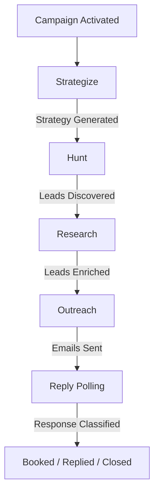

<div align="center">
  <h1>
    
    PHANTOM OSS
  </h1>
  <em>Autonomous client acquisition protocol. Always on the case.</em>
  <br/><br/>
  <p>A state-aware, multi-agent protocol designed to handle the entire client acquisition funnel from cold discovery and deep research to personalized outreach and autonomous booking.</p>
</div>

---

## Philosophy: Agents, Not Workflows

Most sales automation tools are glorified mail-merge with a scheduler bolted on. They follow rigid, linear sequences that break the moment a prospect says something unexpected.

Phantom is different. It deploys **autonomous reasoning swarms** - AI agents that adapt dynamically to lead responses, website context, and business constraints. Each agent in the swarm has a specialized role, its own reasoning loop, and the ability to act on incomplete information. The protocol bridges the gap between raw data and booked meetings without requiring a human to babysit every step.

The result: a self-sustaining acquisition loop that runs while you sleep.

---

## The Phantom Protocol

Phantom orchestrates five highly specialized, state-aware AI agents through a distributed job queue. Each agent picks up where the last one left off, enriching lead state as it moves through the pipeline.

### 1. Strategist Agent

**Role:** Campaign Orchestrator and Planner.

The Strategist analyzes your agency profile - services, target industries, unique value propositions, case studies - and your campaign instructions to generate a hyper-customized acquisition strategy. It doesn't just pick keywords. It defines who you're going after, why they'd care, what to say when they push back, and how to close.

**Output:** Sharpened Ideal Company Profile (ICP), recommended search angles, qualification and disqualification criteria, tone and messaging strategy, objection handling scripts, and key booking triggers.

### 2. Hunter Agent

**Role:** Autonomous Lead Discovery Node.

The Hunter takes the Strategist's search angles and goes hunting. It generates targeted queries, scrapes DuckDuckGo, Google Maps, and other search engines, then scores every candidate against the strategy's qualification criteria using LLM reasoning. Bad fits get cut. Strong matches move forward.

**Output:** Scraped lead candidates enriched with contact details, qualified and scored (0–100) against the Strategist's criteria.

### 3. Researcher Agent

**Role:** Deep Technical and Capability Enrichment.

The Researcher crawls each qualified lead's website using Jina Reader to fetch full markdown pages. It maps specific technical gaps, hiring signals, and pain points back to your value proposition, finding the exact angles that make outreach feel like a conversation, not a pitch.

**Output:** Enriched lead profiles containing verified pain-point hypotheses and bespoke research context.

### 4. Outreacher Agent

**Role:** Human-Centric Personalized Copywriter.

The Outreacher generates highly personalized email sequences, initial message and multi-step follow-ups using the lead's unique research profile and matching agency case studies. Every email references something specific about the prospect. No generic templates. Emails are sent directly via your connected SMTP inbox.

**Output:** Drafted and scheduled outreach sequences sent via Nodemailer.

### 5. Reply Handler Agent

**Role:** Sentiment-Aware Negotiation and Booking.

The Reply Handler polls your inbox via IMAP, classifies every inbound response (interested, asking questions, not interested, out of office), handles objections dynamically, and pushes interested leads to book a call through Calendly. It doesn't just detect intent, it negotiates.

**Output:** Auto-drafted replies and direct booking updates in the database.

### Lead Lifecycle



---

## Architecture

### Tiered AI Router

Phantom uses a provider-agnostic AI routing layer built on the OpenAI-compatible API standard. Every LLM call in the system goes through a two-tier router, fast models for grunt work, smart models for the tasks that actually matter.

| Tier | Used For | Default Model | Override |
| :--- | :--- | :--- | :--- |
| **Fast** | Classification, data extraction, JSON parsing, formatting | `qwen3.7-plus` | `AI_FAST_MODEL` |
| **Smart** | Strategy formulation, personalized copywriting, objection handling, multi-turn reasoning | `qwen3.7-max` | `AI_SMART_MODEL` |

The defaults use Alibaba's open-weight Qwen 3.7 models, but you can point Phantom at any OpenAI-compatible endpoint vLLM, Ollama, Groq, OpenAI, or anything else that speaks the same API.

### BullMQ Job Engine

The agent pipeline runs on BullMQ backed by Redis. No polling loops. No cron hacks.

- **Static global queues** : per agent type (`hunt-Queue`, `outreach-Queue`, etc.)
- **Zero-polling scheduler** : uses Redis delayed jobs to fire campaigns at exact times without querying MongoDB on an interval
- **Self-terminating workers** : workers shut down automatically when their queue drains, conserving resources until more work arrives
- **Exponential backoff** : failed jobs retry up to 3 times with increasing delay

---

## Tech Stack

| Layer | Technology |
| :--- | :--- |
| Runtime | Node.js |
| Backend | Express 5 · TypeScript |
| Frontend | Next.js 16 · React 19 · Tailwind CSS v4 |
| Agent Framework | LangGraph · LangChain (OpenAI-compatible) |
| Database | MongoDB · Mongoose |
| Job Queue | BullMQ · Redis |
| Authentication | JWT · bcryptjs |
| Email | Nodemailer (SMTP) · IMAP polling |
| Scheduling | node-cron · Calendly integration |
| Validation | Zod |
| UI | Framer Motion · Lucide React |

---

## Getting Started

### Prerequisites

- [Node.js](https://nodejs.org/) v20 or later
- [pnpm](https://pnpm.io/) (`npm i -g pnpm`)
- [Docker](https://www.docker.com/) and Docker Compose

### 1. Spin Up Infrastructure

Phantom needs MongoDB for state and Redis for its job queues. The included Docker Compose file handles both:

```bash
docker-compose up -d
```

This starts MongoDB on port `27017` and Redis on port `6379`.

### 2. Configure Environment

Create a `.env` file in the `server/` directory:

```env
PORT=8080
MONGODB_URI=mongodb://localhost:27017/phantomdb
REDIS_URL=redis://localhost:6379
JWT_SECRET=<your-jwt-secret>

# AI Provider (OpenAI-compatible)
AI_API_KEY=<your-api-key>
# AI_BASE_URL=https://dashscope-intl.aliyuncs.com/compatible-mode/v1
# AI_FAST_MODEL=qwen3.7-plus
# AI_SMART_MODEL=qwen3.7-max
```

Create a `.env` file in the `client/` directory:

```env
NEXT_PUBLIC_BASE_URL=http://localhost:8080
```

### 3. Ignite the Swarm

Start the backend engine and the frontend dashboard in separate terminals.

**Terminal 1 — Backend Engine:**
```bash
cd server
pnpm install
pnpm run dev
```

**Terminal 2 — Frontend Dashboard:**
```bash
cd client
pnpm install
pnpm run dev
```

The Phantom dashboard will be live at `http://localhost:3000`.

---

## Configuration Reference

| Variable | Required | Description |
| :--- | :---: | :--- |
| `PORT` | Yes | Backend server port |
| `MONGODB_URI` | Yes | MongoDB connection string |
| `REDIS_URL` | Yes | Redis connection string |
| `JWT_SECRET` | Yes | Secret key for JWT token signing |
| `ENCRYPTION_KEY` | Yes | 32-byte hex string for encrypting stored email credentials |
| `AI_API_KEY` | Yes | API key for the AI provider |
| `AI_BASE_URL` | No | Custom OpenAI-compatible endpoint (defaults to Alibaba DashScope) |
| `AI_FAST_MODEL` | No | Model name for the fast tier (defaults to `qwen3.7-plus`) |
| `AI_SMART_MODEL` | No | Model name for the smart tier (defaults to `qwen3.7-max`) |

---

## Project Structure

```
phantom/
├── client/                  # Next.js 16 frontend dashboard
│   ├── app/                 # App router pages and layouts
│   ├── components/          # React components
│   ├── hooks/               # Custom React hooks
│   └── lib/                 # Client-side utilities
├── server/                  # Express backend and agent engine
│   └── src/
│       ├── controllers/     # Route handlers
│       ├── middleware/      # custom middleware
│       ├── engine/
│       │   ├── agents/      # Agent implementations (strategist, hunter, researcher, outreacher, reply)
│       │   ├── workers/     # BullMQ worker definitions
│       │   └── queue.ts     # Queue factory and configuration
│       ├── lib/             # Core utilities (AI router, Redis, env)
│       ├── models/          # Mongoose schemas
│       ├── routes/          # Express route definitions
│       ├── schemas/         # Zod validation schemas
│       └── services/        # Business logic layer
└── docker-compose.yaml      # MongoDB and Redis infrastructure
```

---

## Contributing

Contributions are welcome - whether it's a bug fix, a new AI provider integration, or an improvement to the agent pipeline. Open a pull request and provide clear context for the change.

Please ensure `pnpm run build` passes in `server/` before submitting.

---

## License

This project is licensed under the [GNU Affero General Public License v3.0](LICENSE).