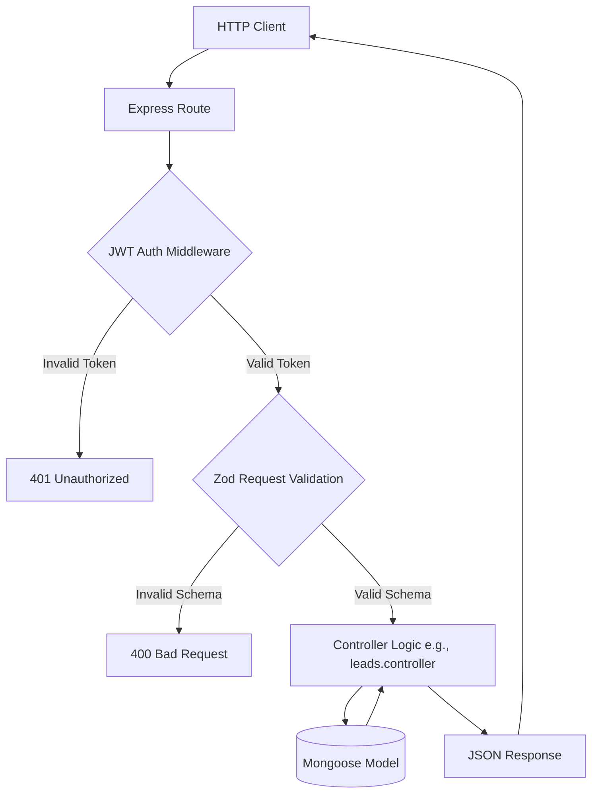

# ⚙️ Phantom Core Server

The analytical backend powering the Phantom protocol. It hosts the multi‑agent swarm, the distributed recursive job queue, MongoDB data persistence, and the Express REST APIs that feed the Next.js dashboard.

---

## 🏗️ Backend Architecture

The backend is split into three main engines:

### 1. 🤖 Multi‑Agent Engine (`src/engine/agents/`)
Specialized agent graphs built with `@langchain/langgraph` to execute domain‑specific logic:
- **Strategist:** Generates strategic campaign directives.
- **Hunter:** Searches, scrapes and scores leads.
- **Researcher:** Enriches leads with pain‑points from website content.
- **Outreacher & Reply:** Generates personalized copy and handles inbound replies.

### 2. ⚡ Global Queue & Worker System (`src/engine/workers/`)
- **Zero-Polling Scheduler:** Uses BullMQ delayed jobs to schedule campaigns at exact times without querying MongoDB.
- **Dynamic Workers:** Workers process from static queues (e.g., `hunt-Queue`) and gracefully shut down when their queue drains to save idle resources.

### 3. 🔌 REST API layer (`src/controllers/` & `src/routes/`)
Secure API endpoints for workspace configuration, auth, and CRM views.

---

## 📦 API Endpoints Documentation

Below is the complete request/response cycle for each public endpoint, including example payloads. All routes are protected by the `protect` JWT middleware and validated with Zod schemas.

### Auth
| Method | Path | Description | Request Body | Response |
|--------|------|-------------|--------------|----------|
| POST | `/api/auth/login` | Authenticate agency user and return JWT. | `{ "email": "user@example.com", "password": "••••" }` | `{ "token": "eyJhbGci...", "agency": { "_id": "64a1...", "name": "Acme Corp" } }` |
| POST | `/api/auth/register` | Register a new agency. | `{ "name": "Acme Corp", "email": "user@example.com", "password": "••••" }` | `{ "agency": { "_id": "64a1...", "name": "Acme Corp" } }` |

### Agency
| Method | Path | Description | Request Body | Response |
|--------|------|-------------|--------------|----------|
| GET | `/api/agency/me` | Retrieve current agency profile. | *None* | `{ "_id": "64a1...", "name": "Acme Corp", "createdAt": "2024-01-01T00:00:00.000Z" }` |
| PUT | `/api/agency/me` | Update agency settings. | `{ "name": "New Name" }` | `{ "_id": "64a1...", "name": "New Name" }` |

### Campaigns
| Method | Path | Description | Request Body | Response |
|--------|------|-------------|--------------|----------|
| GET | `/api/campaigns` | List all campaigns for the agency. | *None* | `[{ "_id": "c1", "title": "Q3 Outreach", "status": "draft" }]` |
| POST | `/api/campaigns` | Create a new campaign. | `{ "title": "Q3 Outreach", "strategy": { "targetICP": "SaaS", "copyTone": "professional" } }` | `{ "_id": "c1", "title": "Q3 Outreach", "status": "draft", "strategy": { ... } }` |
| GET | `/api/campaigns/:id` | Get a single campaign. | *None* | `{ "_id": "c1", "title": "Q3 Outreach", "status": "draft", ... }` |
| PUT | `/api/campaigns/:id` | Update campaign configuration. | `{ "title": "Q3 Revamped" }` | Updated campaign object |
| DELETE | `/api/campaigns/:id` | Archive a campaign. | *None* | `{ "message": "Campaign deleted" }` |

### Leads
| Method | Path | Description | Request Body | Response |
|--------|------|-------------|--------------|----------|
| GET | `/api/leads` | Retrieve all leads for the agency. | *None* | `[{ "_id": "l1", "name": "John Doe", "email": "john@example.com", "status": "new" }]` |
| GET | `/api/leads/:id` | Get a single lead. | *None* | `{ "_id": "l1", "name": "John Doe", "email": "john@example.com", "status": "new", "notes": [] }` |
| PUT | `/api/leads/:id` | Update lead fields (e.g., status, notes). | `{ "status": "contacted", "notes": [{ "author": "strategist", "text": "Reached out via email" }] }` | Updated lead object |
| DELETE | `/api/leads/:id` | Remove a lead from the system. | *None* | `{ "message": "Lead deleted" }` |

> **Note:** All request bodies are validated with Zod schemas located in `src/schemas/` to guarantee shape and type safety.

---

## 📊 API Request/Response Flow Diagram



---

## 🤖 Agents Overview

### Strategist
- **Purpose:** Generates high‑level campaign strategy based on ICP, objectives, and past performance.
- **Key Tasks:** Create `Strategy` Zod schema, produce copy direction, set budget constraints.
- **Integration:** Runs as a LangGraph node triggered by a `strategy` job in the queue. After completion, the job is marked `complete` and downstream agents (Hunter) are spawned.

### Hunter
- **Purpose:** Performs automated web searches, scrapes candidate data, and scores leads.
- **Key Tasks:** Query Serper API, extract contact info, compute relevance score.
- **Integration:** Enqueued via `hunter` job type. Worker claims the job, invokes the Hunter graph, stores scored leads in the `Lead` collection, and emits events for the Researcher.

### Researcher
- **Purpose:** Enriches each lead with contextual pain‑points by scraping their website.
- **Key Tasks:** Fetch landing page HTML, run LLM extraction, attach `painPoints` array to lead document.
- **Integration:** Triggered after a lead is saved by Hunter. Runs as a separate `researcher` job.

### Outreacher
- **Purpose:** Generates hyper‑personalized outreach emails using the `smart` LLM tier.
- **Key Tasks:** Build email subject, body, and follow‑up sequence based on lead data and strategy.
- **Integration:** Consumes `outreach` jobs. After creation, the email payload is persisted in the `Outreach` collection and handed off to the Reply handler via a message queue.

### Reply
- **Purpose:** Classifies inbound replies, handles objections, and books calls via Calendly.
- **Key Tasks:** Sentiment analysis, next‑step recommendation, automated draft generation.
- **Integration:** Listens to inbound email/webhook events, creates a `reply` job, and updates lead status accordingly.

Agents retrieve LLM instances via `getLLM("fast")` or `getLLM("smart")` from `src/lib/ai.ts` per the Tiered AI Router rule.

---

## 📚 Development & Setup

### Installation
```bash
pnpm install
```

### Configuration
Create a `.env` file based on `.env.example`:
```env
PORT=8080
MONGODB_URI=mongodb://localhost:27017/phantomdb
REDIS_URL=redis://localhost:6379
JWT_SECRET=your_jwt_secret_key
ENCRYPTION_KEY=your_32_byte_hex_string_here

# AI Provider API Keys
AI_API_KEY=your_api_key_here

# Data APIs
SERPER_API_KEY=your_serper_api_key_here
HUNTER_API_KEY=your_hunterio_api_key_here
```

### Running
```bash
pnpm run dev   # development with auto‑reload
pnpm run build   # compile TypeScript for production
```

---

## ✅ Testing & Verification
- Run `pnpm test` to execute unit tests for controllers and schemas.
- Verify that each endpoint returns the documented JSON payloads using Postman or cURL.
- Confirm agents execute by inspecting the `jobs` collection for `status: "complete"` after a trigger.

---